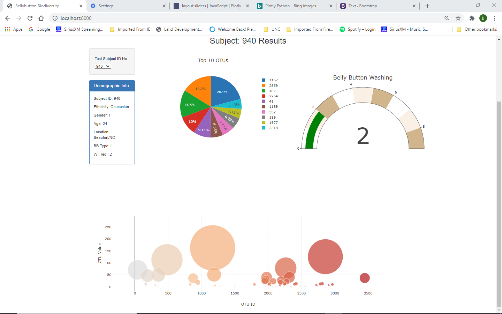

# Plotly-challenge
# Plotly - Belly Button Biodiversity

Built an interactive dashboard to explore the [Belly Button Biodiversity dataset](http://robdunnlab.com/projects/belly-button-biodiversity/), which catalogs the microbes that colonize human navels.

The dataset reveals that a small handful of microbial species (also called operational taxonomic units, or OTUs, in the study) were present in more than 70% of people, while the rest were relatively rare.

# Plotly Dashboards

Top half of the dashboard showing the ability to create a drop down and use the input to populate the plots.
The data changes based on the subject selected.

  

Bottom half of display showing the bubble chart plot.

  

Access the page by going to https://bpezzullo.github.io/Plotly-challenge/

